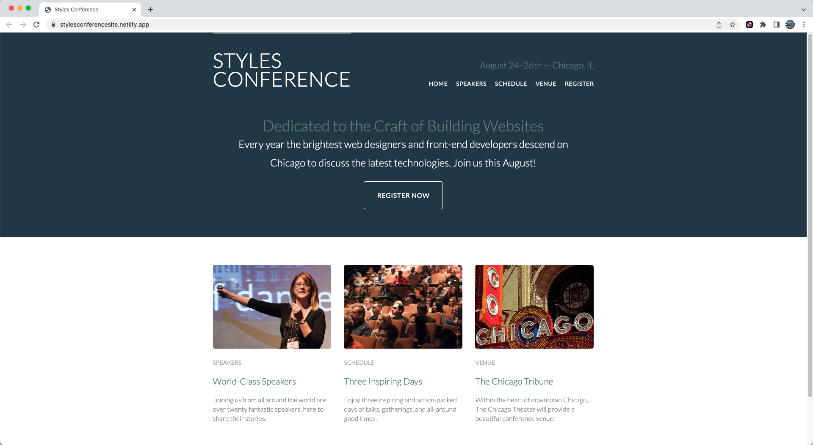

# Creating a Styles Conference Website

### Been a while since I created anything, so I decided to put together an HTML/CSS website with multiple pages to continue practicing my skills and enhance my abilities.

### I enjoyed creating this project, since it gave me the opportunity to work with the box-model, column usage, CSS gradients, organizing data with tables, building forms, iframes, creating lists and practicing best code.

### The more I build projects that are similar in style, the more I feel these principles are becoming ingrained in my memory and more able to recall it at a moments notice. It really becomes fun when it all comes together.

https://stylesconferencesite.netlify.app/

